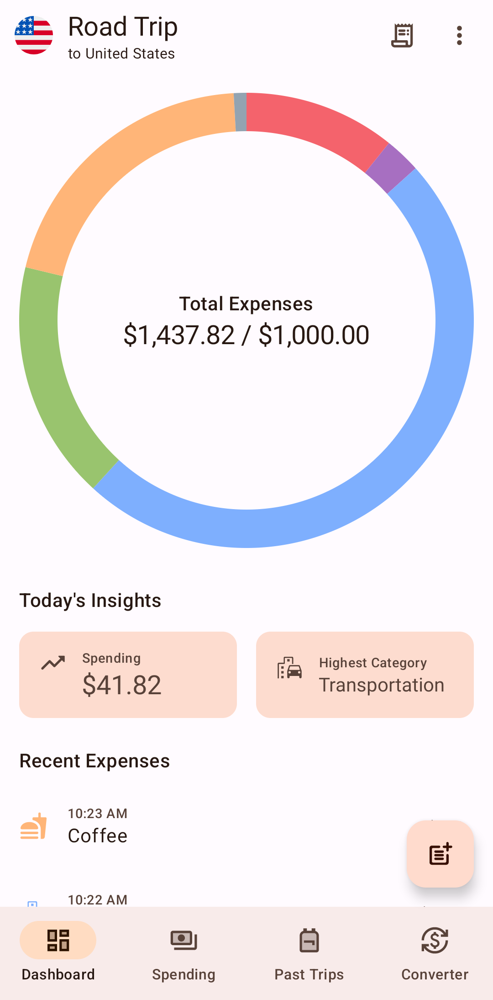
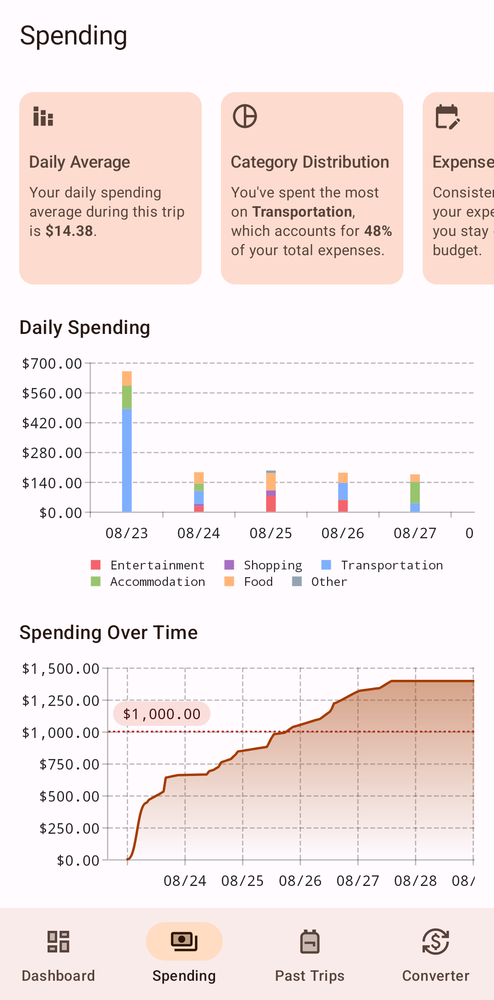
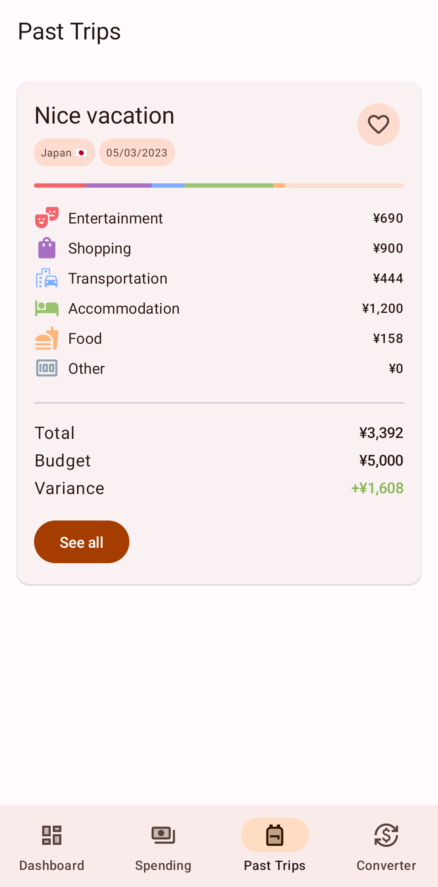
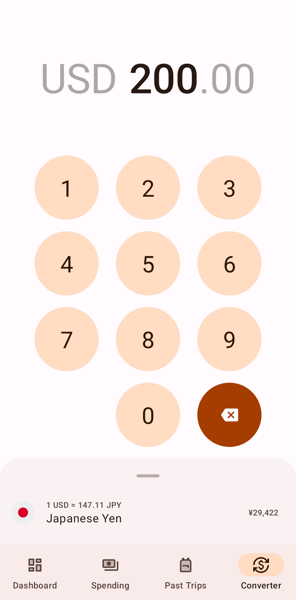
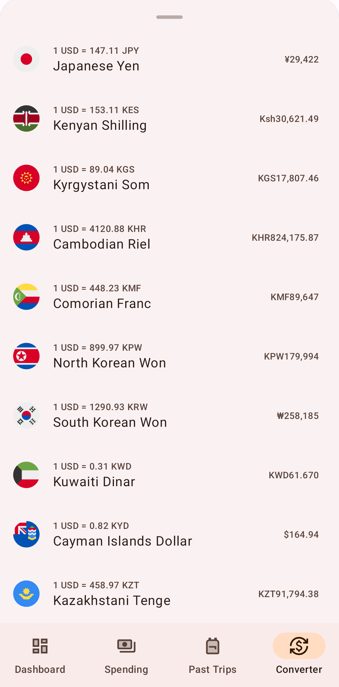
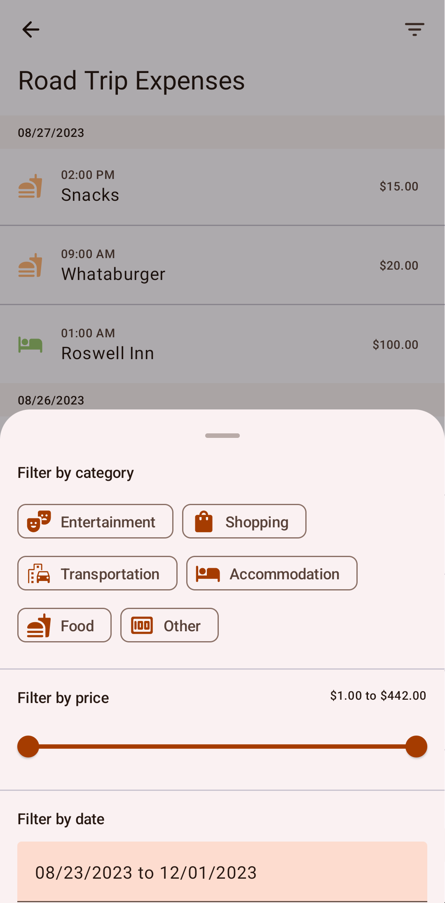

# 🍤 Scrimp

## 🏢 Team
- 📈 Lorena Jacobo `Product Manager`
- 🖥️ Geetesh Kalakoti `Lead Developer`

## 🚀 Features
- Written in Kotlin with Jetpack Compose, Hilt, Kotlin Serialization, Room and other libraries
- Supports Material You and Dark Theme
- Create separate trips and set budgets
- Log expenses and get spending insights about your current trip
- View history of past trips
- Convert between currencies with daily data

## 📷 Screenshots
| | | |
|:-------------------------:|:-------------------------:|:-------------------------:|
|||
|||
|| | |
